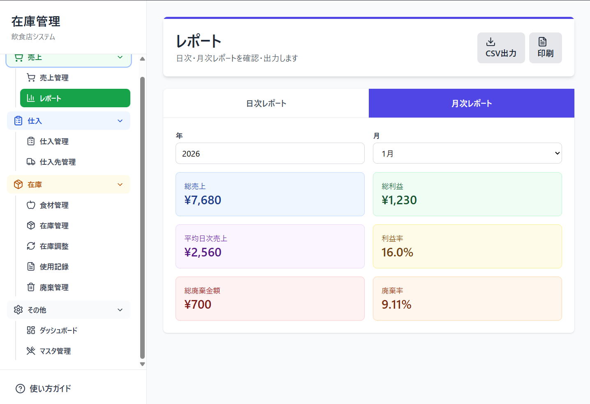

# 🍔 小規模飲食店向け在庫管理システム

<div align="center">

**食品ロスを削減し、利益を最大化する統合在庫管理システム**


> **注意**: このリポジトリはポートフォリオ用です。ソースコードは非公開です。

</div>

---

## 📖 目次

- [システム概要](#-システム概要)
- [開発背景](#-開発背景)
- [主な機能](#-主な機能)
- [画面キャプチャ](#-画面キャプチャ)
- [システム設計](#-システム設計)
- [技術スタック](#-技術スタック)
- [工夫した点](#-工夫した点)
- [開発情報](#-開発情報)
- [今後の拡張](#-今後の拡張)
- [提供可能なサービス](#-提供可能なサービス)
- [開発者について](#-開発者について)
- [お問い合わせ](#-お問い合わせ)

---

## 🎯 システム概要

### これは何か

個人経営・小規模飲食店向けの統合在庫管理システムです。  
売上・仕入・在庫・廃棄を一元管理し、**食品ロス削減と利益最大化**を支援します。

### 対象ユーザー

<div align="center">

| 項目 | 内容 |
|------|------|
| **店舗規模** | 個人経営の飲食店（カフェ、定食屋、居酒屋等） |
| **従業員数** | 1〜10名程度 |
| **ITスキル** | 初心者レベル（スマホ・タブレット操作ができればOK） |

</div>

### プロジェクト規模

- **開発期間**：約1週間
- **画面数**：12画面
- **データベーステーブル**：12テーブル
- **主要機能**：売上管理、仕入管理、在庫管理、廃棄管理、レシピ管理、レポート

---

## 💡 開発背景

### 解決する3つの課題

飲食店経営者が抱える主要課題を解決するため開発しました。

#### 1. 在庫管理の煩雑さ 📋

**課題**
- 紙やエクセルでの管理は手間がかかる
- 在庫数の把握が困難
- 発注タイミングを逃す

**解決策**
- リアルタイム在庫計算
- 発注点アラート
- 発注リスト自動生成

---

#### 2. 食品ロスの問題 🗑️

**課題**
- 賞味期限切れの見落とし
- 廃棄理由の記録不足
- ロス削減の施策が立てられない

**解決策**
- 賞味期限アラート
- 廃棄理由の詳細記録（7カテゴリ）
- 廃棄分析レポート
- 改善提案の自動生成

---

#### 3. 原価・利益の不透明さ 💰

**課題**
- メニューごとの原価が分からない
- 利益率の把握が困難
- 経営判断の根拠がない

**解決策**
- レシピ機能による原価自動計算
- 利益率のリアルタイム表示
- 売上比較機能（前日比・今週・今月・前年同月同日比）

---

### 既存システムとの差別化

**既存の在庫管理システムの課題**

- ❌ 大規模店舗向けで高額（月額数万円）
- ❌ 機能が複雑で小規模店には過剰
- ❌ 導入ハードルが高い

**このシステムの特徴**

- ✅ 小規模店向けのシンプル設計
- ✅ 低コスト運用（Supabase無料枠で可能）
- ✅ 段階的に機能を導入可能
- ✅ 実務フローを徹底的に考慮

---

## ✨ 主な機能

### 1. 売上管理 💚

**主な機能**
- メニュー別売上登録
- 決済方法別集計（現金、クレジット、PayPay等）
- **現金過不足の自動計算**
- 売上比較（前日比・今週累計・今月累計・前年同月同日比）
- CSV出力

**工夫ポイント**
> リアルタイムで利益率を計算し、経営判断をサポート

---

### 2. 仕入管理 💙

**主な機能**
- 仕入記録の登録・一括登録
- **仕入先詳細管理**（連絡先、定休日、納品可能日、支払条件等）
- 仕入単価推移グラフ
- **前回仕入データの参照**（値上がり・値下がりを強調表示）
- 仕入先別・食材別の分析

**工夫ポイント**
> 前回単価との比較で、価格変動をすぐに把握できる

---

### 3. 在庫管理 🟡

**主な機能**
- **リアルタイム在庫計算**（仕入 - 使用 - 廃棄 + 調整）
- **発注点アラート**（在庫が基準を下回ったら通知）
- **賞味期限アラート**（期限が近い食材を警告）
- **発注リスト自動生成**（仕入先ごとにグループ化）
- カテゴリ別フィルター

**工夫ポイント**
> ステータス表示（✅在庫あり・⚠️要発注・❌在庫切れ）で一目で把握

---

### 4. レシピ管理（柔軟な運用）💜

**主な機能**
- メニューと食材の紐付け（任意）
- **原価の自動計算**
- 売上記録時の自動使用記録作成
- **レシピ未登録でも運用可能**

**工夫ポイント**
> 必須ではなく任意登録。段階的に導入できる設計

---

### 5. 廃棄管理 ❤️

**主な機能**
- 廃棄記録（カテゴリ別：期限切れ、品質劣化、仕込みロス等）
- **廃棄金額の自動計算**
- 廃棄分析レポート
- 廃棄率の計算
- **食品ロス削減提案**

**工夫ポイント**
> 法令遵守（食品リサイクル法）に対応した7カテゴリ分類

---

### 6. その他の機能

- **在庫調整**（棚卸し対応）
- 使用記録
- **レポート・帳票**（日次・月次、CSV出力）
- 使い方ガイド

---

## 📱 画面キャプチャ

### ダッシュボード

<div align="center">
  
</div>

**主な表示内容**
- 本日の売上サマリー（売上、利益、利益率、現金過不足）
- 売上比較（前日比、今週累計、今月累計、前年同月同日比）
- 要発注食材アラート（発注リスト生成ボタン付き）
- 賞味期限アラート（3日以内の食材）
- 本日の廃棄サマリー

---

### 売上登録

<div align="center">
  
</div>

**主な機能**
- メニュー別販売数入力（動的に行追加）
- 決済方法別入金額入力（現金、クレジット、PayPay、その他）
- **リアルタイム自動計算**
  - システム計算売上（メニュー別の合計）
  - 実際の売上（決済方法の合計）
  - **現金過不足**（差額を自動計算）
  - 総原価、総利益、利益率
- 売上比較データ表示（前日、今週、今月）

---

### 仕入管理

<div align="center">
  
</div>

**主な機能**
- 仕入記録の登録・一括登録
- **前回仕入データの自動表示**（日付、数量、単価）
- **前回単価との差額を強調表示**（値上がり・値下がり）
- 賞味期限の入力
- 検品メモ

---

### 在庫一覧

<div align="center">
  
</div>

**主な機能**
- **リアルタイム在庫表示**（仕入 - 使用 - 廃棄 + 調整）
- ステータス表示
  - ✅ 在庫あり（緑）
  - ⚠️ 要発注（黄）
  - ❌ 在庫切れ（赤）
- 賞味期限アラート
- カテゴリフィルター
- 発注リスト生成

---

### 廃棄管理

<div align="center">
  
</div>

**主な機能**
- 廃棄記録（カテゴリ選択：期限切れ、品質劣化、仕込みロス等）
- **廃棄金額の自動計算**（直近の仕入単価 × 廃棄量）
- **廃棄分析レポート**
  - カテゴリ別内訳（円グラフ）
  - 食材別廃棄ランキング
  - 日別廃棄金額推移
  - 廃棄率（売上に対する割合）
- **改善提案の表示**

---

### レシピ管理

<div align="center">
  
</div>

**主な機能**
- メニューと食材の紐付け
- 1食分あたりの食材使用量を設定
- **原価の自動計算**
- レシピ登録は任意（登録しなくても使える）

---

### レポート

<div align="center">
  
</div>

**主な機能**
- **日次レポート**（売上、利益、廃棄）
- **月次レポート**（総売上、総利益、平均日次売上、利益率、廃棄率）
- CSV出力
- 印刷機能

---

### 発注リスト

<div align="center">
  
</div>

**主な機能**
- **仕入先ごとにグループ化**
- 仕入先情報（連絡先、定休日、納品可能日等）
- 前回仕入データ（日付、数量、単価、合計金額）
- 合計推奨発注額の計算
- **最小発注額チェック**
- 印刷機能

---

## 🏗 システム設計

### アーキテクチャ

```
フロントエンド（React + TypeScript）
         ↓
    Supabase Client
         ↓
バックエンド（Supabase PostgreSQL）
```

### カスタムIDシステム

視認性と管理性を重視し、通番ベースのカスタムIDを採用：

```
M001, M002 - メニュー
S001, S002 - 仕入先
I001, I002 - 食材
P001, P002 - 仕入
L001, L002 - 売上
W001, W002 - 廃棄
```

**メリット**
- 直感的で管理しやすい
- デバッグが容易
- 小規模店舗には十分なスケーラビリティ

### データベーステーブル（全12テーブル）

<details>
<summary><strong>テーブル構成の詳細を見る</strong></summary>

- `menus` - メニューマスタ
- `menu_ingredients` - レシピ管理
- `sales`, `sales_details` - 売上管理
- `suppliers` - 仕入先マスタ
- `ingredients` - 食材マスタ
- `ingredient_suppliers` - 食材-仕入先関連
- `purchases` - 仕入記録
- `usage` - 使用記録
- `waste` - 廃棄記録
- `inventory_adjustments` - 在庫調整
- `settings` - システム設定

</details>

---

## 🛠 技術スタック

<div align="center">

| レイヤー | 技術 | 採用理由 |
|---------|------|----------|
| **フロントエンド** | React 18 + TypeScript | 型安全性、保守性 |
| **UIフレームワーク** | Tailwind CSS | 高速開発、統一感 |
| **バックエンド** | Supabase (PostgreSQL) | 低コスト、自動API生成 |
| **ビルドツール** | Vite | 高速ビルド |
| **ホスティング** | Vercel | 無料、簡単デプロイ |

</div>

### なぜこの技術構成なのか

**TypeScript + React**
- 型安全性による品質向上
- 保守性の高いコードベース
- 豊富なエコシステム

**Supabase**
- PostgreSQLの強力なリレーショナルDB
- 自動API生成で開発スピード向上
- 無料枠で小規模店舗に最適
- リアルタイム機能

**Tailwind CSS**
- ユーティリティファーストで開発効率向上
- デザインの一貫性
- レスポンシブ対応が簡単

---

## 🎨 工夫した点

### 1. 小規模店舗への徹底配慮

#### 柔軟なレシピ管理

**課題**
- 全メニューのレシピ登録は負担が大きい
- 段階的に導入したい

**解決策**
- レシピ登録は任意（必須ではない）
- 登録すれば自動計算、しなくても手動記録可能
- 段階的に機能を追加できる設計

---

#### 簡単操作

- **デフォルト値の自動設定**（初期設定の手間削減）
- **一括登録機能**（複数記録を同時登録）
- **直感的なUI**（カテゴリ別メニュー、使い方ガイド）

---

### 2. 実務フローの徹底分析

飲食店の実務フローを詳細に調査し、以下を実現：

#### 仕入先詳細管理

実務で必要な情報を網羅：

- 連絡先（電話・メール）
- 定休日・納品可能日
- 最小発注金額
- 支払条件
- 納品時間

**工夫ポイント**
> 発注リストに仕入先情報を表示し、リストを見ながら発注できる

---

#### 発注リスト自動生成

- **仕入先ごとにグループ化**
- 前回仕入データを参考表示
- 連絡先を表示（発注リストを見ながら電話可能）
- **最小発注額の自動チェック**

**工夫ポイント**
> 実際の発注業務フローを考慮した設計

---

#### 売上比較機能

経営判断に必要なデータを自動表示：

- 前日比
- 今週累計
- 今月累計
- 前年同月同日比

**工夫ポイント**
> 増減を色とアイコンで表現（↗️ 緑、↘️ 赤）

---

### 3. UI/UX設計

#### 機能別カラーコーディング

7色で機能を色分け、視覚的に操作画面を識別：

<div align="center">

| 機能 | カラー | 狙い |
|------|--------|------|
| ダッシュボード | インディゴ | 全体像の把握 |
| 売上管理 | グリーン | ポジティブな印象 |
| 仕入管理 | ブルー | 冷静な判断 |
| 在庫管理 | アンバー | 注意喚起 |
| 使用記録 | パープル | 記録の印象 |
| 廃棄管理 | レッド | 重要性の強調 |
| マスタ管理 | グレー | 基礎情報 |

</div>

---

#### 視認性の向上

- 重要数値は大きく表示（24px以上）
- 増減を色とアイコンで表現（↗️ 緑、↘️ 赤）
- アラートは目立つ色と配置
- **完全レスポンシブ対応**（スマホ・タブレット・PC）

---

### 4. 食品ロス削減対応

#### 法令遵守（食品リサイクル法）

廃棄理由を7カテゴリで詳細記録：

1. 期限切れ
2. 品質劣化
3. 仕込みロス
4. 調理ミス
5. 提供ミス
6. 食べ残し
7. その他

**工夫ポイント**
> 法令に準拠した分類で、適切な記録管理を実現

---

#### 改善提案の自動生成

廃棄分析結果から自動で改善提案を表示

**例**
- 「期限切れが多い食材：〇〇」
- 「仕込みロスが増加傾向」
- 「廃棄率が先月より上昇」

---

## 📊 開発情報

### 開発期間：約1週間

<div align="center">

| フェーズ | 期間 | 内容 |
|---------|------|------|
| 要件定義・設計 | 1-2日 | 業務フロー調査、システム設計 |
| 基本機能実装 | 2日 | 売上・仕入・在庫管理 |
| 拡張機能実装 | 2日 | レシピ、廃棄、レポート、UI改善 |
| テスト・調整 | 進行中 | 機能テスト、バグ修正 |

</div>

### 開発体制

- **設計・実装・テスト**：1名
- 最新の開発ツールを活用した効率的な開発

### 使用技術・ツール

- TypeScript、React、Supabase
- Cursor（コードエディタ）
- Git / GitHub（バージョン管理）

---

## 🚀 今後の拡張

### 追加予定機能

- [ ] 複数店舗対応
- [ ] POSレジCSV取り込み
- [ ] バーコード管理
- [ ] メール通知機能
- [ ] PDF出力

### カスタマイズ対応

お客様の業種・業態に合わせたカスタマイズも可能です：

- 業種特有の機能追加
- 既存システムとの連携
- UIデザインの調整
- レポート項目のカスタマイズ

---

## 💼 提供可能なサービス

現在はポートフォリオ制作・検証開発を中心に、  
小規模・試作ベースでの業務効率化支援に対応しています。

### 1. Google Apps Script（GAS）を用いた小規模業務自動化・管理ツールの構築

**対応例**
- スプレッドシート連携システム
- メール送信・通知の自動化
- 手作業で行っている定型業務の自動化

---

### 2. Googleスプレッドシートを基盤とした在庫・顧客・請求情報の管理

**対応例**
- 在庫管理システム
- 顧客管理システム
- 請求書発行システム

---

### 3. 本リポジトリのようなWeb技術を用いた業務管理システムの試作・検証

**対応例**
- React + Supabaseを使った管理システム
- 業務フローを整理しながらの要件定義・画面設計
- 実運用を想定したプロトタイプ作成

> ※ 現在はポートフォリオ用途として段階的に開発・検証を行っており、  
> 提供形態や範囲については個別検討ベースとなります。

---

## 👤 開発者について

### 制作者

**[Misako]**

Google Workspace とWeb技術を中心とした  
**小規模業務の自動化・効率化ツールの試作・検証開発**を行っています。

### 開発スタンス

- ヒアリング・要件整理を重視した設計
- 小さく作って、動かしながら改善する進め方
- 実務フローを徹底的に分析した実装

### 得意・関心分野

- 業務効率化・自動化ツールの設計・試作・改善
- Google Workspace / React / TypeScriptを活用したシステム開発
- 手作業・属人化している業務の整理と仕組み化
- 小規模運用を前提とした、無理のないシステム設計

**「この作業がなくなったら、どれくらい楽になるか」**  
を起点に考えることを大切にしています。

---

## 📩 お問い合わせ

### ポートフォリオ全体に関するご相談・ご質問

公式LINEまたはクラウドソーシングサイトよりご連絡ください。

#### 📩 公式LINE（推奨）

[👉 公式LINEで問い合わせる](https://lin.ee/LQKST5q)

- **気軽にご相談いただけます**（24時間受付）
- 簡単な質問やヒアリングに最適
- レスポンス：原則24時間以内

#### 💼 クラウドソーシングサイト

- [ランサーズ](https://www.lancers.jp/profile/Mi1103)
- [クラウドワークス](https://crowdworks.jp/public/employees/6463085?ref=share_url_wkprofile)
- [ココナラ](https://coconala.com/users/5336527)

**「こんなこと相談していいのかな？」という段階からでも大歓迎です。**

---

## 📄 ライセンス

このシステムのソースコードは非公開です。  
ポートフォリオ用のドキュメント・画像は閲覧のみ可能です。

商用利用をご希望の場合は、お問い合わせください。

---

## 🎓 今後について

本システムは、個人事業主向け業務効率化ツールとして検証・改善を継続中です。

現在はポートフォリオ用途を主目的として公開しており、  
商品サービス化や提供形態については今後検討予定です。

---

<div align="center">

**食品ロスを削減し、利益を最大化する統合在庫管理システム**

---

**制作者**: [Misako]  
**制作時期**: 2026年1月  
**開発言語**: TypeScript, React  
**データベース**: Supabase (PostgreSQL)

---

⭐ このプロジェクトが参考になりましたら、Starをいただけると嬉しいです  
📢 シェア・拡散も大歓迎です

---

*最終更新日: 2026年2月*

</div>
